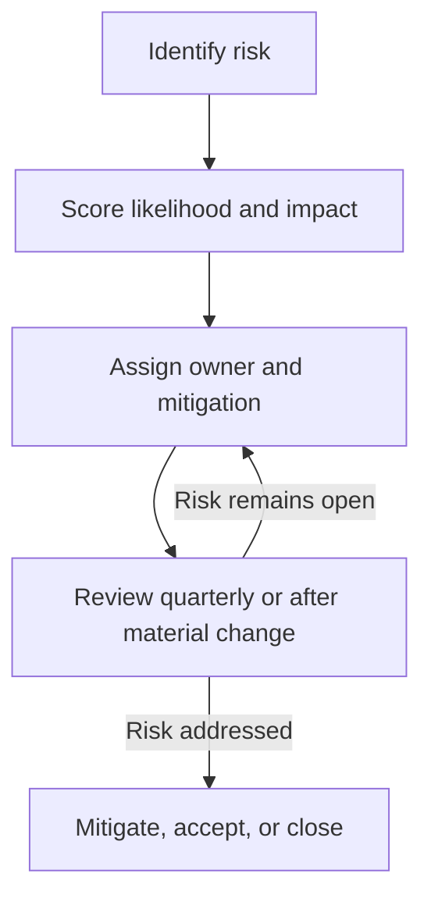

# Risk Register

## Purpose

Track operational, compliance, security, vendor, and incident-response risks that require ownership, mitigation, and periodic review.

## Scoring

Likelihood:

- 1: Rare
- 2: Unlikely
- 3: Possible
- 4: Likely
- 5: Almost certain

Impact:

- 1: Low
- 2: Moderate
- 3: Material
- 4: High
- 5: Severe

Risk score equals likelihood multiplied by impact.

## Risk Workflow

## Register

| ID | Risk | Category | Owner | Likelihood | Impact | Score | Mitigation | Status | Review Date |
| --- | --- | --- | --- | --- | --- | --- | --- | --- | --- |
| R-001 | Incident response procedures are incomplete or untested. | Incident response | TBD | 3 | 4 | 12 | Maintain written procedures, tabletop exercises, and post-incident review records. | Open | TBD |
| R-002 | Customer notice procedures do not meet required timing or content standards. | Compliance | TBD | 3 | 4 | 12 | Maintain notice templates, escalation paths, and legal review workflow. | Open | TBD |
| R-003 | Service-provider oversight does not capture breach notice obligations. | Vendor risk | TBD | 3 | 4 | 12 | Review contracts and maintain vendor incident notice tracking. | Open | TBD |
| R-004 | Backup custodian materials are incomplete or stale. | Recordkeeping | TBD | 2 | 5 | 10 | Maintain current operational-source package and periodic custodian refresh evidence. | Open | TBD |
| R-005 | Team members may paste customer PII, investor records, issuer records, credentials, or other confidential regulated data into AI tools. | Data protection | TBD | 3 | 5 | 15 | Adopt an AI-use rule that prohibits submitting customer or regulated data to AI tools unless an approved controlled workflow exists; train team members to redact sensitive details before using AI assistance. | Open | TBD |

## Status Values

- Open
- In progress
- Mitigated
- Accepted
- Closed

## Review Cadence

Review the register at least quarterly and after any material incident, vendor change, system change, or regulatory update.
