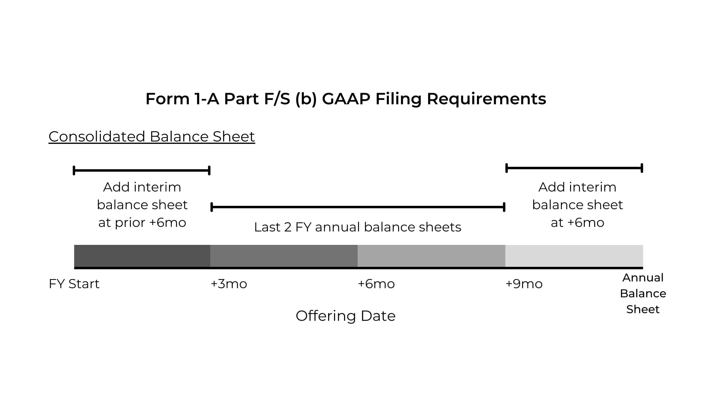

# Community Discussion: Preventing Insider Trading 🚫📉

I wrote this post in an airport lounge, where I’m leeching off the buffet for 10 hours before my flight. Might not be as fun as exploring LA, but it saves a few bucks to go towards rent. 🏠

Whether we like it or not, the government knows a lot about us. They know when and where you fly. 🛩️ They theoretically know how much you earn, the stability of that income, and where it comes from. 💼 They know what kind of car you drive, how many traffic tickets you’ve racked up, and of course where you live (at least unless it’s in a [separate entity](https://www.nytimes.com/2024/03/03/us/politics/judge-ruling-corporate-transparenct-act.html)). And that’s not even mentioning *Snowden*.

This isn’t a post about government oversight, but the topic seems [particularly](https://www.youtube.com/watch?v=De4QjH9fpgo&list=PL4qw3AkxFDSMxJRioymD9lFZu7JMdPWOU) [relevant](https://www.investopedia.com/tech/who-charlie-shrem/). More specifically, by the end of this post, you’ll understand my nuanced view of how we (do and) should regulate newfound digital assets. The biggest question in my mind comes down to information distribution. 🕵️‍♂️ Consider a currency like US dollars. There are only a handful of people that know anything material about USD value at any given time. They all work at high levels of the private profit-sharing [Federal Reserve](https://lnns.co/aMnb-DPLoIX).

Considering almost the whole world uses dollars, we can safely say only ~0.0000001% of the population have **insider knowledge** about USD value. 💹 (Currencies trade against each other.) 🔄 And of course all these people presumably have tight informational and trading restrictions imposed on them by the government. Almost like corporate insider investing or trading rules. 🤔

Now consider Bitcoin, the only digital asset presently classified by our government as a commodity. 🌟 Almost from day one (compared to other blockchain networks), Bitcoin had no insiders. Certainly, Nakamoto was influential in committing original code, ideas, and limits. But, after [ghosting the industry](https://www.youtube.com/watch?v=Ew5XMjaXTF4&list=PLWUFvhKuc_5tun_1KTLil_t-7mEbOckcJ), the pseudonymous contributor disappeared from society.

## Early Bitcoin Days 🌱

In the beginning, I think there is a real argument that Nakamoto was an insider out of the [few hundred](https://www.youtube.com/watch?v=r8xCmCq1muE&list=PLD_o9ntBnmGam9BuoTr_4cjPOksi1Dl1A) early Bitcoin adopters. Namely, Nakamoto was a driving force in building out new network infrastructure themself. They were effectively releasing a new product and then letting others claim their own stake vis-a-vi mining.

A [series of dot-com companies](https://www.bloomberglaw.com/external/document/X3SPR1KG000000/capital-markets-professional-perspective-airdrops-are-free-token) gave away free stock early on, in a similar spirit of fostering user adoption, increasing total investors, and gaining beneficial publicity. 👀 The SEC ultimately ruled these giveaway offerings as illegal securities law violations. 👩‍⚖️ And I think Bitcoin would have faced a similar outcome early on if meaningfully brought into courts before 2013.

Could the government have shut it down? [Certainly not](https://www.youtube.com/watch?v=97ufCT6lQcY&list=PLWUFvhKuc_5uICfadww4PR76Rd2bl2MdT). 🏛️ But we might at least have better case law to reference today than the nuanced and intricate Ripple ruling with qualified purchasers. However, relevant to this discussion, very quickly after Nakamoto disappeared, Bitcoin effectively became a living thing. 🫀

While control of certain web2 functions was handed off to another active developer, the actual Bitcoin blockchain was off to the races with an independent, completely decentralized, and self-incentivizing system. 💸 A radical [innovation](https://www.linkedin.com/pulse/step-function-innovation-myth-overnight-success-john-wooten-akl7e/) that ultimately lead an self-organizing community of open-source developers to continually improve upon Nakamoto’s [revelation](https://www.ussc.gov/sites/default/files/pdf/training/annual-national-training-seminar/2018/Emerging_Tech_Bitcoin_Crypto.pdf).

Over a decade and a half later, regulators, investors, and users alike agree that nobody has any **inside knowledge** of Bitcoin’s next steps. 🛤️ Everything from code, mining software, and wallet implementations are open-source for everyone to see. Therefore there arguably exists no insider knowledge across digital assets (and therefore no need to regulate many cryptosystems for investor protections, like with commodities disclosures).

## Corporate Securities 🏢

Let’s talk more about digital assets in the comments. 💬 I think Ethereum’s number of insiders falls between that of Bitcoin and the Bank of England. Still extremely low, and not something any regulated broker would impose insider trading disclosures around, aside from PEP checks.

Insider trading laws have a relatively interesting history, which warrants a scholarly introduction:
***

### Our Current Rules Evolved from State to Federal Law 📜

Warren Earl Burger was one of the longest-serving Chief Justices in the US Supreme Court, known for his extensive experience in securities cases. Around 1980, the Court debated a series of cases questioning Federal oversight of stock lending. In *Santa Fe Industries, Inc. v. Green*, the Court had to decide whether to invoke Rule 10b-5 to protect investors in a case about a public company going private. ⚖️ In question: whether anti-fraud provisions applied to an allegedly undervalued "coerced" valuation from a major investment bank? [More thoughts](https://privates.jfwooten4.com).

The Court ruled that anti-fraud procedures in Delaware law applied over Rule 10b-5. This was a common theme throughout *Bankers Trust v. Mallis*, *Rubin v. United States*, and other cases. The Court explicitly tried to delegate investor protection power down to States. 🤝 That was until *United States v. Naftalin*—a 1979 case about [failures to deliver](https://amzn.to/3uRuqx4).

Big brokers were on the hook for this loss, so the Court exerted Rule 10b-5 to protect them. Based largely on Burger being absent in a surgery, it was arguably a scandalous, rushed ruling. 🏃🏽‍♂️ The ruling has profound implications on our current securities regulation regime. And Congress hasn’t questioned it since...

*Rubin v. United States* called into question what a "sale of securities" included. The final decision was based on a minor difference in wording between the Securities Act of 1933 and the Securities Exchange Act of 1934. Its precedent was a clause in *Naftalin* arguing that securities laws were meant to be interpreted broadly to "include the entire selling process." By extension, the Court was defining the truly broad scope of power now entrusted to the SEC. 👮🏾‍♂️ Briefly, the ruling led to a broader interpretation of Rule 10b-5 to include almost all trading.

### Globalization of Fraud Prevention 🤥

As securities laws evolved in American courts, the main objective was always preventing fraud. 🇺🇸 The difficulty for judges was simply determining who needed to handle wrongdoings. 🫤 As our regime elevated from State to Federal oversight, so too did our markets move from local brokers to national exchanges. This trend warrants further investigation given [open web3](https://blockstream.com/satellite). 

>When the Legislature incorporated the Bank of Illinois, it anticipated that its stock would be bought primarily by in-state investors. Instead, most shares were purchased by financiers in the East, who deviously use the names of Illinois farmers as owners of the stock.

>— Michael Burlingame

Capital (mostly) flows intelligently to any market's best opportunities, no matter regulations, social norms, or your currency of denomination. 🧧

In the internet era, international companies can access international investors with the [click of a button](https://finance.yahoo.com/news/traders-flouted-bitmex-us-trading-142817763.html). 🖱️ Entering web3, how do we protect investors against widespread [fraud](https://www.sec.gov/news/press-release/2018-53), [deceit](https://www.justice.gov/usao-sdny/pr/manhattan-us-attorney-announces-charges-against-leaders-onecoin-multibillion-dollar), and [inadequate disclosures](https://fortune.com/crypto/2024/03/03/sec-coinbase-insider-trading-kraken-howey-binance-ripple-terra/) in an increasingly worldwide capital market?

This roots of this question came up in last week’s [Taking Stock](https://linktr.ee/takingstockpodcast). 🔉 Namely, we were quibbling with how to prevent insider trading while protecting investor privacies.

### Is Insider Trading Bad? 🤔

Say 5–40% of public company employees have insider knowledge at any time. I think it makes sense to impose [restrictions](https://www.duke-energy.com/our-company/corporate-governance/securities-trading-policy), [public disclosures](https://www.sec.gov/Archives/edgar/data/320193/000032019321000071/xslF345X03/wf-form4_162984422696515.xml), and [ongoing oversight](https://www.occ.gov/publications-and-resources/publications/comptrollers-handbook/files/insider-activities/pub-ch-insider-activities.pdf) to prevent insider trading. My view is further detailed in [this comment letter](https://www.sec.gov/comments/s7-15-23/s71523-301019-767522.pdf). Briefly, I’ve seen market manipulation firsthand. I can almost *feel* when something doesn’t add up with the candlesticks. Would love to get on a trading podcast to elaborate. 🎙️

The challenge with insider trading is investors don’t really see their losses. 🔍 It’s a more nuanced, delayed extraction of value by corporate crooks. When they dump their shares after incredible earnings, for example, the stock still increases X%. But in reality, without insiders cashing in, you could argue that shares should’ve gone up Y%. It’s the same difficulty I face in explaining the international suppression of securities prices [from FTDs](https://www.youtube.com/watch?v=544BAtk2KLg&list=PLWUFvhKuc_5tD62OdZIv3HUaf4eBaQzG8).

Mixed opinions surfaced with [Chives](https://www.youtube.com/watch?v=pfwEXHaNM54&list=PLD_o9ntBnmGaSraKlePO35JwWLvr2dl0r). I’d appreciate further discussion with everyone here. We can effectively police insider trading thoughtfully without completely revoking user privacy. 👩🏻‍💻 It just comes down to designing open community reporting, analysis, and enforcement tools.

## Replacing Trade Reporting Facility/Rule 613 🤓

Clearly, we aren’t building these new systems to foster increased government oversight. 📹 [A](https://www.youtube.com/watch?v=Ak455GlYqok) [number](https://www.forbes.com/sites/davidbirch/2021/05/03/im-anti-the-anti-money-laundering--rules/) [of](https://freedomandprosperity.org/2021/blog/the-pointless-burden-of-anti-money-laundering-laws/) [privacy](https://www.gisreportsonline.com/r/why-anti-money-laundering-policies-are-failing/) [advocates](https://www.elucidate.co/blog/5-reasons-why-the-global-anti-money-laundering-system-is-failing-financial-institutions) [criticize](https://content.11fs.com/article/aml-is-the-worlds-most-ineffective-policy-experiment) the [ineffectiveness of AML laws](https://doi.org/10.1080/25741292.2020.1725366). I think we can build a unified global identity system based on the principles of Gitcoin Passport which lets us stop money laundering while preserving privacy with zero-knowledge proofs. It is technically possible. 👁️ The only blocking factor is a true desire to do the right thing over [making profits](https://www.youtube.com/watch?v=WwXPZohTJ4w&list=PLWUFvhKuc_5tD62OdZIv3HUaf4eBaQzG8).

Every company starts as an idea in someone’s head. In other words, 100% of the first company employees have insider knowledge, largely because the actual product might not even be built yet. 💭 Accordingly, early pitches clearly represent an insider conveying their knowledge to an investor until they can convince them to pay money for a chance at a dream. 🙇🏽‍♂️ For example:
***

### Securities Anti-Fraud Laws Hold Issuers Accountable 🛡️

When one party to a securities offering knows more than another, regulation steps in to [protect the public](https://www.fbi.gov/contact-us/field-offices/lasvegas/news/press-releases/man-who-received-more-than-3-million-selling-unregistered-diamond-mine-stock-sentenced-to-four-years-in-prison). 🚨 Historically, that regulation has moved from State jurisdiction to Federal interpretation of securities laws. While this article linked extensively to FBI investigations, remember that the SEC [prepares most cases](https://www.youtube.com/watch?v=0C0Sj6Us19I&list=PLrB8PjaXSV6uFL9o9WenCw9rwCHTyju5M). [Transparency](https://www.issuers.info/) best keeps insiders honest, helping avoid the FBI in the first place.

These fallbacks are important because present private placement laws rightfully allow [broad investor segments](https://www.sec.gov/education/capitalraising/building-blocks/accredited-investor) to invest in startups. 🧠 By keeping the bar low for early fundraising, we effectively promote informed investment in the next innovators. 👍

### Private Company Disclosures 📊

We all know murder is wrong and bad. 🙅‍♂️ But we still write down laws and list out criminal criteria. Knowing the rules to play by is the definition of corporate accounting, the foundation of quality investor disclosures. 🧮

Early employees often wear all hats at a startup. Say over 80% of these employees have insider knowledge. Today, it is complicated, expensive, and slow to trade these private shares. With TAD3, it’s easy, instantaneous, and free. Accordingly, we think private market secondary trading rates will skyrocket in the coming years alongside the drastic increase in [companies staying private](https://site.warrington.ufl.edu/ritter/files/IPO-Statistics.pdf) to avoid legacy listing costs. 💰

However, many private offering registrations or exemptions rely on unspecific compliance data. That makes it hard to ensure comprehensive reliance on current laws. 📄 Take for example a timeline of statements needed in some 506(b) placements with unaccredited investors:
***

### Lack of Clarity 🤔

This might seem like a simple checklist of documents to follow, but in reality, there is little to no Federal definition of what constitutes a balance sheet or statement of profit, loss, and retained earnings in connection with a JOBS Act Title IV offering. This leaves private issuers guessing at standards. 😕 Don’t even get me started on a lack of Federally-recommended reporting schemes for private securities transactions, financial performance, or corporate actions.

As [more innovators found startups](https://blocktransfer.com/.well-known/deck.pdf) worldwide, we need to think deeply about our increasingly distributed online market for capital. 🌎

In *Marine Bank v. Weaver*, the Supreme Court ruled that an investment contract involving a Certificate of Deposit was not a security. Chief Justice Burger wrote that investors “are abundantly protected under the federal banking laws.” Accordingly, the alternate regulatory regime protected the CDs from SEC oversight. But the ruling left open a lack of predictability for secondary transactions that is more relevant now than ever given the rise of [decentralized exchanges](https://www.youtube.com/watch?v=YFca255hXj8&list=PLWUFvhKuc_5u1sQsz-FAmRgFf9HEhyqj-). Rather, the court deferred to a stance that "each transaction must be analyzed and evaluated on the basis of the content of the instruments in question, the purposes intended to be served, and the factual setting as a whole." 🤨 Without truly answering the crucial question of horizontal commonality, we’re effectively left guessing at what a common enterprise entails under *Howey*.

In a world with millions of issuers, billions of investors, and trillions of transactions, it’s not reasonable to manually inspect each and every trade. It is reasonable to regulate issuer offerings, as our present securities regime does. But I believe we need to take a step back and call into question the intent of an offering itself in certain instances of digital assets so as to comprehend the nuance of an investment opportunity over the limited horizons of Rule 144. ⏰ We need a comprehensive overarching framework to pre-empt the legacy system.

## International Blockchain Assets Standard Society 🌐
- Digital assets are **not** legacy banking, securities fundraising, or commodities trading.
- They are a new global tool with widespread implications, namely for impoverished nations.
- We need to organize a global Blockchain Assets Standard Society with diverse representation.

***
No warranties provided. This post is not legal or professional advice.
