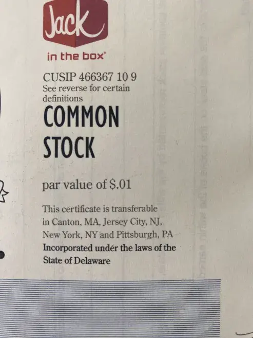
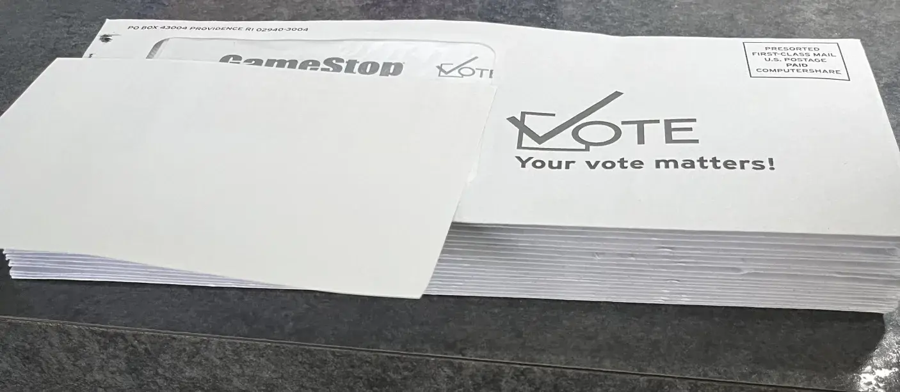

# Re: Discord Community Developments & Our Nonprofit Growth

<!--- make landscape if you can AI expand here --->

It's been a very active week as many of us turn to WhyDRS with increasing fervor. 🤝 From what I've seen, that means more time, effort, and thought put into our next steps. There's a long road ahead, as we've all discovered these past few years imo. Incredible to think how much we can all accomplish together. 🛤

I'm trying out this new format as a way to efficiently respond to interesting recent thoughts. Let me know what you think per [attempts to streamline involvement](https://discord.com/channels/1102309240145707049/1221274503821131797/1222265778376544327). 💬 It seems I've been [missing](https://x.com/JFWooten4/status/1785641217805459492) material [discussions](https://lemmy.whynotdrs.org/post/1395252) with my existing approach of some quick time each week to glance over main insights.

> This kind of work is a(n unpaid) full time job. I dont expect anyone to stay up on all of it all the time unless they’re deeply entrenched in the day to day.
>
> &mdash; [wtfeweguys](https://discord.com/channels/955819881989808128/1068991643828633732/1236392978583519262)

Hopefully this new format will help organize otherwise disparate thoughts in a central place. All around, I appreciate community members who help organize new information by [mentioning me](https://discord.com/channels/1102309240145707049/1221274503821131797/1221485041498984619) when relevant. Your DMs, [timely references](https://discord.com/channels/955819881989808128/1068991643828633732/1236392509718921276), and [public conversations](https://www.listennotes.com/podcast-clips/taking-stock-episode-24-tracking-direct-plan-eZ5RjFUK3Pm/) mean a lot and help organize pending thoughts. 💭

---

# Background

Relevant to this new discussion medium is the evolving structure of Discord conversations. 🗣 Half of the chat links above come from a private "internal team" server rather than the public Discord. Moreover, (future) community members frequently discuss important web3 governance topics [across](https://discord.com/channels/897514728459468821/1082054027317096478/1225404545241448479) [the](https://discord.com/channels/1042985282531766353/1219894740279885835/1227038372799709224) [web](https://www.youtube.com/post/UgkxZLBI2YL9j0ldcVjphleyBrleTz5VXPJ2). 🌐

As some community members have voiced these last couple weeks, much of our work can feel like shouting into a black hole. 🌌 As someone with twice as many [YouTube](https://www.youtube.com/jfwooten4) videos than subscribers, I'm right there with you. Ideally, more sharable documentation like this will help spread our [important messages](https://www.marketliteracy.org/) at scale. While we've been diligently promoting our ideals, this next chapter of newfound organization might renew our passion, direction, and influence. ✊

I won't pretend to know exactly where all this goes. That's [for all of us to decide in concert](https://discord.com/channels/955819881989808128/1221128163384623114/1221132458745921676). 🧠 But we had a great start with our conversation last week on [Taking Stock](https://linktr.ee/takingstockpodcast) and in the biweekly [internal dialogue](https://discord.com/channels/955819881989808128/1194680207207059537/1235422980977328189) thereafter. 🎙 And hopefully these responses promote a permissionless, transparent, and direct [governance system](https://discord.com/channels/1102309240145707049/1231401381441568778/1237441982960369806) that's easy for anyone to reference, search, and chat around.

---

# 1. Regulation of Transfer Agent "Plan" Services

Firstly, we've been talking about important nuances in DSPP and other Plan custody schemes for months. I'd like to draw attention to the legal [plan definition](https://www.law.cornell.edu/definitions/index.php?def_id=9d243016b094305eb1f0d06587e0caf6) and SEC thoughts on their regulation:

> Transfer Agents [with plans] all provide some level of transaction execution and order routing services.
>
> Netting is a function commonly performed by clearing agencies and may also be performed by broker-dealers for customers holding in street name, but is not among the core functions enumerated in Exchange Act Section 3(a)(25) performed by registered transfer agents. Hence, netting and other execution services may not themselves implicate transfer agent requirements, but nonetheless may trigger broker-dealer regulatory requirements.
>
> "Effecting securities transactions" includes, among other things, identifying potential purchasers of securities, soliciting securities transactions, routing or matching orders, handling customer funds or securities, and preparing and sending transaction confirmations (other than on behalf of a broker-dealer that executes the trades).
>
> Receiving transaction-based compensation may also indicate that a person is effecting securities transactions for the account of other.
>
> The Commission has brought enforcement actions against transfer agents operating as broker-dealers without registering as such with the Commission. For example, the Commission found that a transfer agent was acting as an unregistered broker-dealer in violation of Exchange Act Section 15(a) when it, among other things: opened accounts for individual retirement account ("IRA") customers
>
> Furthermore, a transfer agent that effects securities transactions for investors in connection with administering certain types of Issuer Plans may be engaging in broker activity. 
>
> &mdash; SEC [File No. S7-27-15](https://wooten.link/TAR)

Relevantly, the most recent staff guidance on what transfer agents can and can't do in terms of direct trading involvement boil down to a handful of [no-action letters](https://www.sec.gov/files/rules/exorders/2006/34-53667.pdf) issued largely before the turn of the century. It's been very difficult to revisit the topic given the advent of blockchain technology. ⛓ This is why I think transfer agent regulations have sat on the SEC's docket for nearly a decade after the release referenced. ⌛

This is not an easy question as it requires a complete rethink of the origination and processing of transactions from the basis of shares in your own name. For instance, we've discussed [historic services](https://www.sec.gov/comments/sr-dtc-2006-16/dtc200616-39.pdf) providing direct market access [at](https://discord.com/channels/1102309240145707049/1102309240741310503/1208904390312988673) [length](https://discord.com/channels/1102309240145707049/1231401381441568778/1237260786804461610) over over the past two months. 📜 Much of this conversation ultimately comes down to the crux of our problems: the DTCC as a monopoly marketplace. And this particularly starts to [matter](https://discord.com/channels/1102309240145707049/1231401381441568778/1237441982960369806) given their [de-facto regulatory role](https://www.sec.gov/comments/sr-dtc-2006-16/dtc200616-32.pdf)&mdash;which may or [may not](https://discord.com/channels/1102309240145707049/1216793196538101823/1220470529002311820) be constitutional. ⚖

All this is part of why governance matters so much to TAD3. When you can [directly trade without middlemen](https://www.blocktransfer.com/blog/post/investor-to-investor-direct-trading), the line starts to blur on exactly a transfer agent [can and can't do](https://drive.blocktransfer.com/show/external/publish/6e0mme8b654e4f87a4414aa65f81ecbb53fc5). 🤔 And I think the best people to define that boundary are investors themselves [officially](https://discord.com/channels/1102309240145707049/1229803464314585129/1230523702324760687) or [directly](https://discord.com/channels/1102309240145707049/1102309240741310503/1191565884993576970).

---

# 2. Blockchain and Direct ETFs

> DRS doesn't solve the ETF problems. 
>
> ETFs can still create and redeem without the asset being available. That's the problem. 
>
> Even if we DRS Book the whole float, ETFs will still trade with GME in them, legally too.
>
> &mdash; [Born Luckiest](https://discord.com/channels/955819881989808128/1068991643828633732/1236306721471725568)

I'm not entirely sure what you mean in terms of the legacy ETFs still trading with GME since if we DRS all the shares than in theory those holding companies should have to get their shares from a directly-registered source. So in that case it seems you would just be pushing institutional adoption of direct holding, which could of course lead to outflows from DRS. 🔀 There's some nuance there, and I'd like to talk more about some other corner cases community members had about TAD3 on a Taking Stock AMA sometime. The implications may be [hidden or third-order](https://discord.com/channels/955819881989808128/1068991643828633732/1236391115477880975), but I think the details matter. 🗨

Stocks on chain fundamentally reimagine how we engage with ETFs, introducing a level of granularity in ownership that traditional methods simply can’t match. Picture an ETF not as a bundled package sold under a single ticker, but as a direct, real-time portfolio of individual assets on a blockchain. 🔗 This vision allows investors to own and trade fractions of the actual assets within an ETF without intermediaries or the need for bundled products. 👀

## 2.1 Elimination of Management Fees

In traditional ETFs, management fees are charged to cover the costs of managing and operating the fund. However, with direct ETFs on the blockchain, each asset can be bought and sold individually without the need for a fund manager. This setup removes the management fees typically associated with ETFs, as investors manage their investments directly through their digital wallets, interacting with the market on a peer-to-peer basis. 💻

## 2.2 No Premiums or Discounts

Traditional ETFs can trade at values that deviate from the net asset value of their underlying assets, either at a premium or a discount, influenced by market dynamics and liquidity concerns. With blockchain-based direct ETFs, investors purchase tokens that represent actual ownership of the underlying assets. 🎯 This direct linkage ensures that the trading price of these tokens is aligned with the real-time value of the assets, not affected by the speculative pricing often seen in traditional ETF markets.

## 2.3 Personalized Rebalancing

Blockchain facilitates a high degree of control over investment portfolios. Investors can adjust their asset holdings in real-time to align with personal financial strategies and goals, without waiting for the ETF provider to make quarterly or annual adjustments. This control allows for dynamic portfolio management, enabling investors to respond quickly to market changes or shifts in their investment outlook. 📈

---

# 3. Ongoing DAO Organization

> [nonprofit advocacy organizations] don't exist yet, the structure only becomes legally possible on 7/1/2024, so I couldn't point you to an official one that is legally recognized.
>
> &mdash; [LastResortFriend](https://discord.com/channels/955819881989808128/1207198663202316338/1236314433127710750)

We've discussed the importance and material implications of building a distributed governance structure for the ape movement behind closed doors for a while now. I believe this is the materialization of a true market reform in the making. Namely, this community is one of the first groups I've heard of working with a pure intention to create a better [public system](https://digitalpublicgoods.net/digital-public-goods/) for everyone to manage their assets. As a nonprofit should be:

> there’s no distributed ownership/economics element to it. I’m pointing out there’s no ownership/economics to it *at all*.
>
> &mdash; [wtfeweguys](https://discord.com/channels/955819881989808128/1059557502183800972/1138465617222041723)

## 3.1 Documenting Journey

Starting as a loosely organized advocacy group on Reddit, our community has grown into a more structured ensemble on Discord, allowing for deeper and more focused discussions. This transition was not just about changing platforms but about evolving our methods of engagement and decision-making to better suit our growing needs and objectives. The community has successfully organized with major innovations from finding good meeting times across time zones to facilitating bulk distributed work on a quality centralized database.

## 3.2 Open Source Development
Recognizing the need for a collaborative and transparent development environment, we may consider turning to GitHub. This platform allows us to not only host and review code but also to manage specific TAD3 projects and documentation effectively. It's here that we can begun building the components of an open-source securities trading and settlement ecosystem, leveraging the collective expertise and enthusiasm of our community.

## 3.3 Universe Panel Sharing
To further our understanding and refine our approach, might we consider hosting a panel discussions that brings together experts from our community. These discussions could prove invaluable for sharing knowledge, challenging our assumptions, and drawing lessons from our DAO successes and setbacks. It's essential to document our progress through detailed roadmaps and public events imo. These deliverables serve not just as planning tools but also as historical records of our journey. They help new members understand our evolution and ensure that our goals are aligned and clear.

---

# 4. Figurehead of Sorts

> No one is comfortable being that central leader, so the roadmap and structure fill the role enough for a few people to pass it around.
> 
> &mdash; [LastResortFriend](https://discord.com/channels/955819881989808128/1207198663202316338/1236319836502757548)

I believe there are some [material risks](https://www.youtube.com/watch?t=5272&v=rbjFjda3_UI) in leading this movement given the vested interests, bad actors, and material disruption TAD3 or a similar system [introduces](https://www.linkedin.com/pulse/step-function-innovation-myth-overnight-success-john-wooten-akl7e/). Ideally, Block Transfer itself can field most of any legal challenges that arise from disrupting Wall Street. 🏛

In terms of a speaking head in public, I'd be happy to throw myself in the ring. The GitHub event could be a good starting point. I'm more than happy to put more time into content like this if it's materially sustainable. 🌱 It ultimately comes down to what the broader community wants in terms of speaking for yourself v. having a reliable representative ready to promote necessary ideological advancements. 🎓

What we're building is more than just software, recordkeeping, or business services. It's a fundamental rethink of capitalism that's that "nail in the coffin" of Wall Street complementing the "hammer" of effective advocacy. 🔨 In my view, that also means a complete rethink of system governance to enable a longstanding replacement piece of public infrastructure. 🔩

---

# 5. Proxy Voting Email Manipulation

Per [our official writeup](https://www.drsgme.org/2024-agm-emails):

> Undetected suppression is difficult and probably reserved for higher ups. It seems too deliberate to be accident
>
> &mdash; [6days1week](https://discord.com/channels/955819881989808128/1059557502183800972/1236346776810815518)

Firstly, exceptional efforts bringing this to light on X [through](https://x.com/6days1week/status/1786024585961340953) [detailed](https://x.com/6days1week/status/1786084841164886117) [posts](https://x.com/6days1week/status/1786398728401654038). 👍 Tremendous job getting primary sources collected and disseminated exposing potential ulterior motives driving profit interests above effective governance. While the regulations around traditional paper systems v. online communications are thorough, this kind of deceit is unfortunately not yet illegal per any mailing [codifications](https://www.law.cornell.edu/cfr/text/17/240.14a-16). 📬

Having designed our email notification system for proxy distribution, I agree that this is highly unusual. 🧐 As shown with virtually all other companies, these emails are supposed to be standard variable changes and nothing more. 🤖 It's almost always the exact same format with merged fields for every other stock. The only reason in my view for this kind of tomfoolery is that they are hiding something.

Per recent inquiries on other transfer agents, I'll reiterate that I don't like to speak poorly of legacy agents since the true enemy here is the DTCC per [Taking Stock](https://linktr.ee/takingstockpodcast) #16. Rather, might we all just collectively develop and standardized system and take first action as the inaugural Transfer Agent Depository? 🧮

---

# 6. Private v. Public Markets

> Would be nice to find a continuously updated list of companies that aren't public anymore (due to going private, acquisition, merger, or bankruptcy) but I didn't see anything like this
>
> &mdash; [gorillionaire2](https://discord.com/channels/955819881989808128/1054094702904881213/1228904857348472904)

Hopefully the issuers.info API solves many of these challenges. But I'd like to call into question what exactly we mean with public v. [private](https://privates.jfwooten4.com). The application legally here has to do with primary offerings and specifically what kinds of investors a company can sell stock to. 💵 But that's not the whole picture in an ongoing efficient market system like TAD3.

Namely, the system is built to enable anyone to trade after statutory limitations around holding periods. In English, that means anyone can sell their shares to anyone else after a year or less, in America at least. 💱 The trading itself as referenced earlier via the SDEX per [open protocols](https://github.com/blocktransfer/yellowpaper) thus enables widespread trading whether or not a company is "public."

## 6.1 Public - What Does it Mean?

From the perview of the SEC, a public company means an EDGAR filer subject to Section 12 or 15(d) of the Securities Exchange Act of 1934. While that might sound technical, it is just the same set of reporting standards you're used to seeing around quarterly and annual reports. 📰 And the regulations themselves have statutory thresholds for when you must start filing documents, such as reaching over 2000 investors. 🕵️‍♀️ Interestingly, our regulations themselves have little to say about any statutory requirement to have securities trading through intermediaries themselves.

## 6.2 Private - Can You Still Trade?

For instance, consider that I have a private company, [MonerAds](https://www.youtube.com/playlist?list=PLWUFvhKuc_5tVzjb1xXSnpVx0E42K3nQD). I sell you some shares, which become tradable in a year under Rule 144. Now you sign a contract with Joe Public transferring the stock in exchange for $X cash. 💼 This private transaction, valid under basic anti-fraud law, creates a small market for my private company's stock, even though I never met with or offered securities to Joe Public. And now that Joe has unrestricted shares, he can sell to whomever he wants, and so on. 📑

## 6.3 TAD3 - Blurring the Lines

All the assets Block Transfer acts as agent for can trade along these lines, on the basis of quality widespread transparent public information. The overall accounting system, built on Stellar, is the same fundamental technology for all underlying assets, peers, and jurisdictions. 🏳 Our central role comes in just to manage the ongoing nuances of international compliance, primary placements, and protective regimes. So, when the difference between private and public is simply who the company can sell stock to, do widespread direct investor markets inherently place all companies on the same playing ground of direct capitalism? 🚀

---

# 7. Real World Demonstrations

> [community member] wants more boots on the ground work, and honestly I'm fine with him being a team leader on stuff like that. It's not what I do, it's what some others are interested in, but don't have experience in where to start. I think part of the issue is most of us in this discord are researchers and makers... I've always seen this group as various departments with team leaders, but never one central leader... I think getting the 501c going will help bring in funding, which we need for the advocacy efforts. And the DAO is the most reflective way of how we operate.
>
> &mdash; [Bibic Jr](https://discord.com/channels/955819881989808128/1207198663202316338/1236401955027423302)

Not sure if demonstrations is the right word here, since it seems a lot of our work is slowly undoing very nuanced legal frameworks designed to put the money of the masses in the pockets of a few Wall Street insiders. 👔 But aside from that, if we want to do more live demonstrations, I'd also be happy to help and rally support using any means available. I love that the SEC does remote virtual meetings, allowing more diverse perspectives from community members that might have neither the time, resources, nor inclination to travel to D.C. like traditional lobbyists for instance. 📞

---

# 8. Selling Our Ideas

> I think everyone here understands the value of marketing.
>
> &mdash; [6days1week](https://discord.com/channels/955819881989808128/1207198663202316338/1236421358754467953)

As I disused privately with Chives [here](https://discord.com/channels/955819881989808128/1221128163384623114/1231998507343155342), I've also been down the [marketing hole](https://www.youtube.com/watch?v=md_EWTLmgjc&list=PLWUFvhKuc_5u3hvR4LquRZkZgWZzwkbBh) with my first blockchain startup, [various online courses](https://sponsor.jfwooten4.com/), and [stock investing book](https://ninetonoonsecrets.com/free-book). 📚 It is a lot of work, and hopefully the new DAO structure will help us adequately attract and nurture top media talent. 👁‍🗨 I'd be happy to dedicate more time on it if reasonably feasible.

---

# 9. Potential DWAC Integration

> This all sounds fantastic to me. The only note I'd push back on is DRSing shares being a way to earn tokens. This could be something that bad actors abuse by DRSing their own companies, not to mention hard to prove without a trusted individual going to see the stockholder lists to verify.
>
> &mdash; [Bibic Jr](https://discord.com/channels/955819881989808128/1194680207207059537/1235497588283674696)

If Block Transfer is the transfer agent for issuers in question, then we could track incoming DRS transfers and issue corresponding governance tokens in real time. ⚗️ It's trivial to check if someone is an insider, put safeguards around that, and only reward someone's first direct registration. Even if we only observed TAD3 data as an impartial network peer, we can trustlessly achieve the same outcome depending on the insider identification scheme, which is an ongoing area of development per SEC Rule 15c2-11(b)(5)(i)(P) and [this post](https://lemmy.whynotdrs.org/post/1166651). 🤓

---

# 10. Local Transfer Restrictions

> I believe this is a list of the cities you can transfer certificates from one person to another.  I hadn’t seen a list like this before.
>
> &mdash; [6days1week](https://discord.com/channels/955819881989808128/1141860946302734336/1236392655835893801)

These geographical restrictions appear to be an outdated and unusual practice that does not align with modern regulatory frameworks or the global nature of today's securities markets. 📃 Under current SEC regulations, notably [Rule 17Ad-15](https://blocktransfer.com/compliance/signature-guarantees), there are no stipulations that should restrict the transfer of securities based on geographic location within the United States or internationally, unless specific sanctions or legal considerations apply. 🖋

These limitations may stem from legacy practices or misunderstandings of the regulations, which are increasingly incompatible with the principles of open and accessible markets. 🌎 The goal of securities regulations is to ensure fair, efficient, and transparent markets, not to impose unnecessary barriers to ownership. 🚧 Such restrictions are inhibitive, [disenfranchising investors](https://github.com/wootenwealth/sponsors/blob/main/publications/balancing-the-world.pdf) based on their location, which contradicts the global trend towards more inclusive financial participation. 💳

Given the global desire to own American securities and the widespread use of digital and blockchain technologies that transcend physical borders, any practice that limits investor participation geographically should be rigorously questioned and reevaluated. 🛡️ A consortium of national securities regulators, alongside the investing public as a whole, need to clarify these issues and align practices with the principles of modern, inclusive, and efficient markets. 🤲

---

# 11. Issuer's Master Tabulator Nuances

> Brokers as I understand it, just send voting forms to EVERYONE who has any holding of the stock on the record date. I believe there's two reasons for this; Firstly the voting data they pass to the share issuing company... is just an approximated aggregate of the voting opinion for their shareholders with weighting based upon each clients shareholding. Secondly, it aids to keep up the public facing illusion that a fractional actually 'exists' in the stock trading world and they are not just cashflow and lubricant for the order pipeline.
>
> &mdash; [Born Luckiest](https://discord.com/channels/955819881989808128/1092773217187401758/1232702462599761940)

This extends the broker implications from #1 and the SEC's historic leniency on Plans, as discussed. Relevantly, companies can choose their agent or another tabulation monopoly to manage and inspect the vote per [discussion thereto](https://discord.com/channels/955819881989808128/1092773217187401758/1232702462599761940). The implication from the EDGAR link there falls onto Delaware courts, where everyone operates from. When they rule the partial shares valid under the standard pretense of property rights, then the voting implications expand greatly depending on how honest your outsourced master and book tabulator [decides to act](https://discord.com/channels/1102309240145707049/1102309240741310503/1235236333291704360), given no meaningful regulation over "black box" voting results. I don't see a way to fix this without [completely digital votes](https://patent.jfwooten4.com). 🗳

[Environmental impacts](https://discord.com/channels/1102309240145707049/1102309240741310503/1237167774053171262) 🌍

---

# 12. Certain Broker's 3% Cash Back Card

Just so we're all on the same page, credit card fees are 2–3%. The card companies, interestingly, were originally nonprofits charging lower rates. But their "public utility status" ultimately gave way to rent-seeking profiteers that controlled the stock. 🤑 When retailers tried to add this as a line item on bills in the early 2000s, these companies pushed back and convinced them to add cash prices as a "discount." Apparently calling the payment system what it is&mdash;an added cost baked into good prices&mdash;was too harmful to their [money-printing](https://www.youtube.com/watch?v=C85pyqSqcd8&list=PLWUFvhKuc_5tD0NuFpppsQotuOj9T892C) business model. 💁‍♀️

All this to say that issuing banks like Coastal Community Bank in [this case](https://discord.com/channels/955819881989808128/1053098661355208794/1222586398033580123) get ~2% of transaction volumes back in revenue split with the card companies. The extra money paid chiefly comes from the fees you pay each month for a "special account." Coinbase had a similar promotion like this briefly after their IPO where you got 5% back on all debit card purchases in Stellar Lumens. 💸 Unfortunately, take rates are about half as much on debit cards, making this program even more expensive to finance. In fact, my account's card was deactivated after extensive use, and they have much lower reward rates today. ❌

All this to say that the program in question also leads to a fundamental conversation about our financial system. 🏦 I personally love the consumer protections, cash back, and other perks credit cards offer. But are these benefits, when considered across society, worth the underlying costs of a transaction tax not recouped by [uncreditworthy](https://www.youtube.com/watch?t=29&v=YUwqzeaR1lA) everyday purchasers, staggering amounts of [enslaving debt](https://www.youtube.com/watch?v=dRd-QDJsaio&list=PLWUFvhKuc_5sDW-0Elb1tc-TffW1xbpMh), and ongoing oil-based plastic producing [global pollutants](https://www.youtube.com/watch?t=241&v=JaMJi1_1tkA&list=PLWUFvhKuc_5uICfadww4PR76Rd2bl2MdT)?

---

# 13. Ken Griffin Interview Comments

> Take a close look at JP Morgans recent annual report and 10K under legal actions, the OCC and FED's action against them and pending DOJ outcome. They have been facilatating quite a bit of offshore trading for over a decade. I would presume, most of the prime brokers have been involved in the same unsupervised trading. &mdash; [bellweirboy](https://discord.com/channels/955819881989808128/1059573570122023022/1236768167066468403)

This comment was made in response to an interview where [Ken seems to be using a teleprompter](https://discord.com/channels/955819881989808128/1059573570122023022/1236718800167112897). I'd like to talk a little more about the [routing implications](https://slate.com/business/2023/09/dumb-money-gamestop-wall-street.html#:~:text=the%20movie%20uses,a%20few.) per **[this prerequisite context](https://www.youtube.com/clip/Ugkxb4KmEoSZE6q6nlmTurodkB59S5RmGCMX).** 🌀

My perspective comes from having actively traded based on dark pool and offshore volume, including building an [AI model](https://www.youtube.com/watch?v=QafkIh2nvY0&list=PLWUFvhKuc_5vyAfq_AbWz-wSl82p_xtH9) around it before GPT3. Hopefully, [upcoming legislation](https://discord.com/channels/1102309240145707049/1237440895968608346/1237441786050514944) will finally [fix all these problems](https://www.linkedin.com/pulse/gamestop-first-successful-short-squeeze-john-wooten-xvyne/#:~:text=Luckily%2C%20the%20SEC%20is%20actively%20fixing%20this%20problem%20now). 🙌 Moreover, much of these challenges were detailed in *Flash Boys*, inter alia.

All this to say, I think there is a lot more going on here that gets swept under the bridge of public oversight because of the fragmented global securities trading regulatory regimes. Ideally, blockchain solves all this with a simple, transparent, immutable record of market transactions. 🔍 We will prevail so long as we continually fight to decentralize securities trading and settlement, disintermediate global capital markets, and definitively open-source Wall Street.

---

# Closing Thoughts
> I am really excited for CAT - I do think we'll see if they are able to delay the 5/31 start. There are two lawsuits filed against the SEC that essentially claim the new market surveillance tool violates constitutional privacy rights.
>
> &mdash; [Chives](https://discord.com/channels/1102309240145707049/1102309240741310503/1236429874936283196)

This isn't a lighthearted question in light of [recent action](https://www.cnbc.com/2024/04/30/binance-founder-changpeng-zhao-cz-sentenced-to-four-months-in-prison-.html) against CZ (and that's after a $4bln fine). ⚠ Most transfer agents today have wholly inadequate AML/KYC programs when compared to the excessive scrutiny expected from cryptocurrency exchanges. 👥 Since they were traditionally banks, I guess politicians just decided at some point that SEC-regulated transfer agents didn't need specific laws promoting America's [policy agendas](https://www.youtube.com/watch?v=Ytaa_5liwMA&list=PLWUFvhKuc_5uctL1INAcqa-Blz7fslRd9&t=5207).

Given the [material privacy concerns](https://x.com/JFWooten4/status/1779619647114870933) over web3, we should continually quander and ultimately outline a global approach to inclusive financial market access. Yet another material governance consideration that I believe should come from investors themselves by means of the democratically-elected officials we have [the direct power](https://discord.com/channels/1102309240145707049/1102309241026515066/1194738748236247070) to support in alignment with our views. ☑

## Looking Forward Together
> Take the idea of market literacy a step further. What do we as a group generally mean by that? What have we learned by becoming more market-literate? What problems/concerns have we surfaced? What do we feel can be done about those concerns?
>
> &mdash; [wtfeweguys](https://discord.com/channels/955819881989808128/1068991643828633732/1236390482653745283)

We have a lot to uncover together, and I'd love to have more community members on [Main Street Markets](https://www.blocktransfer.com/investors/podcast) to further document their investment background. 🎤 I firmly believe we can make better decisions in consideration of all known factors by understanding [the background](https://www.youtube.com/watch?v=pfwEXHaNM54&list=PLD_o9ntBnmGaSraKlePO35JwWLvr2dl0r) of our community members themselves. In a perfect world, that means we can best define the full scope and longstanding implications a [fundamental rethink](https://drive.blocktransfer.com/external/writer/0d1d496f6722054b2fc24fd8b926a2384a61fc70cf1251060d2d8b279d570499) of [how capitalism works](https://discord.com/channels/1102309240145707049/1102309241026515066/1235250664020639785).

> W/o any competitive pressure computershare will probably not change a thing
>
> &mdash; [beyond-mythos](https://discord.com/channels/955819881989808128/1059557502183800972/1192744747933106196)

Wholeheartedly agree on this point, which is why I believe we have so much potential to shake up the industry. 🏭 Consider the worst case where our step function innovation and collaboration acts as a potential "competitor" to the legacy system. 💡 What's the worst that could happen aside from forcing more innovation, transparency, and automation? By addressing the larger narrative of ownership and control within financial systems, we can begin to forge pathways towards a more equitable and transparent market built for the 99%. This is not just about exposing Wall Street; it’s about establishing a new norm for financial interactions that prioritizes equality, accessibility, and accountability. 📱

## OCC Margin Comment Letter
There are [so many problems](https://www.sec.gov/comments/sr-occ-2024-001/srocc2024001-typeh.htm) in our markets, and I can't think of any other community better suited to tack them. 🤳 In the coming week, in as much time as I can find while [packing up to move](https://www.linkedin.com/pulse/from-trader-trailblazer-web3-stock-investments-sec-review-john-wooten-zvxbc/), I'll be working on a detailed comment letter per [recent news](https://lemmy.whynotdrs.org/post/1410399). 👈

Given the [monopolization of securities trading and settlement](https://chicagounbound.uchicago.edu/cgi/viewcontent.cgi?article=1016&context=law_and_economics_wp), I believe we can convince regulators to extending FOIA access to non-governmental entities, just as they did with FTD data in the 2000s. 👨‍💻 These systemically important financial institutions have virtually no threat of competition given the impossibility of replacing their systems with anything outside of blockchain, which obviates the need for any such middlemen entirely.

Given that this is the main reason requests have historically been denied for financial SROs, the unbelievable [lack of transparency](https://www.sec.gov/files/rules/sro/occ/2024/34-99393-ex3.pdf) in [this rule](https://www.sec.gov/comments/sr-occ-2024-001/srocc2024001.htm) might just be the straw that [breaks the camel's back](https://discord.com/channels/1102309240145707049/1102309240741310503/1235233377234194513) given the risk of options clearing amidst high volatility. 💥

> the opportunity is ripe isn't it
>
> &mdash; [Born Luckiest](https://discord.com/channels/955819881989808128/1053332205428035686/1234968235791749130)

## Isolated Community Discussions
I believe in [information transparency](https://x.com/JFWooten4/status/1781101573944340987), at least for movements like this, where we aren't working on something related to national security. I understand that the original private server exists so that [top contributors](https://x.com/JFWooten4/status/1776717577344921880) can communicate in confidence and outside the risk of being misquoted out of context. 😶 Please let me know if responding to quotes in a more [public and pseudonymous](https://x.com/JFWooten4/status/1780623146724290616) manner like this steps inside the boundaries intended by having two separate Discords. Ideally, we can get [everything material](https://x.com/JFWooten4/status/1777390422517575833) into the hands of comprehensive [public oversight](https://www.youtube.com/watch?v=fpdca1gJioI&list=PLD_o9ntBnmGaaB2VMsdtrpN13KPpPcT-W), save for spam risk. Minds together stronger? 🧠
